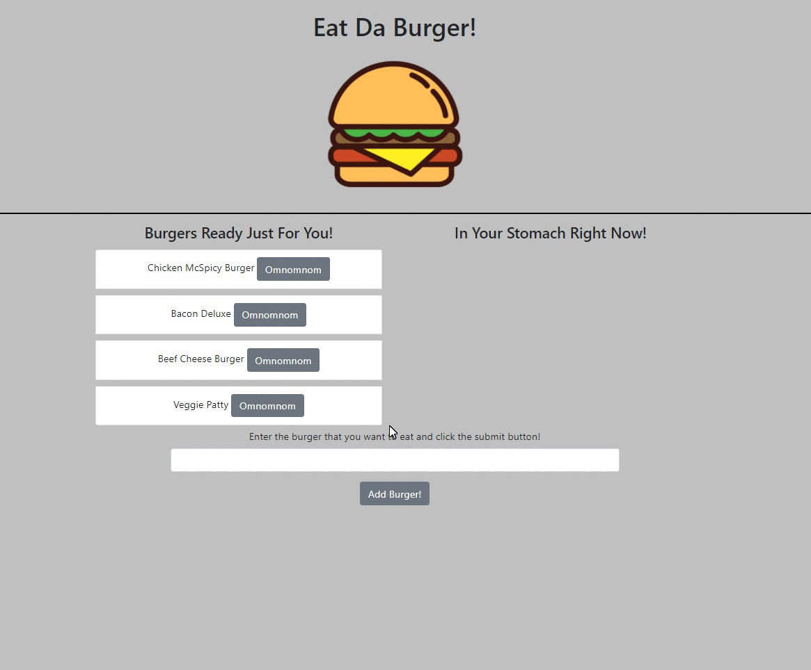

# Eat Da Burger!
## Description

An application that allows users to create and devour burgers (virtually)!

[](https://opensource.org/licenses/MIT)


## Installation

Make sure that Node.js and MySQL Workbench are installed, then run this in the terminal
```
npm install
```

## Usage

### Two Ways to access the application:
1. Click [here](https://sleepy-hollows-06121.herokuapp.com/) to launch the application
2. Run "node server.js" or "npm start" in the terminal, then ctrl+click on the shown link. Be sure to navigate to the project folder before doing so

- To make yourself a burger, type in the name of the burger in the input section and click the "Add Burger!" button just below it
- Created burgers will have "Omnomnom" buttons next to it. Click it to devour the burger!


## License

License for this project: MIT

## Contributing

1. Fork/Clone this repo
2. Hack away!
3. Create a new pull request
4. Good commits will be accepted

## Testing




## Questions

If you have any questions/doubts, feel free to contact me via:
* GitHub: [https://github.com/ZanHong](https://github.com/ZanHong)
* Email: [mokzanhong92@hotmail.com](mailto:mokzanhong92@hotmail.com)
